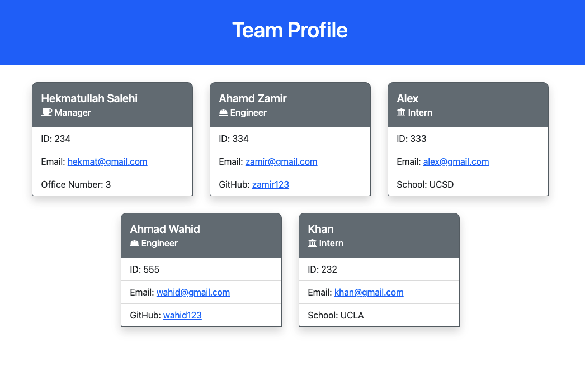

# Team Profile Generator
## Description
This is a  Node.js command line application that takes in information about employees on a software engineering team, then generates an HTML webpage that displays summaries for each person.


## Table of Contents
* [Installation](#Installation)
* [Usage](#Usage)
* [Test](#Test)
* [License](#License)
* [Questions](#Questions)
## Installation
Clone the team-profile-generator repository to your local computer. Run ```npm install``` in the command line (Win) or terminal (Mac) to install the ```inquirer and jest``` dependencies. 
## Usage
Open Command line (Win) or Terminal (Mac). Go to team-profile-generator folder then run ```node index.js``` enter manager's information then choose from the list to add an Engineer or an Intern or to Finish building team. When the Finish building team is selected an HTML file with the entered information will be generated.


 
[Walkthrough Video](https://drive.google.com/file/d/1ifz6FXchPGbma0tLDP6kkX2NTyBfvFdo/view?usp=sharing)

## Test
Run ```npm test``` in the Command line (Win) or Terminal (Mac) to see the test result.

## License
This Application is covered under MITLicense

For more information about the License visit [MIT License Page](https://choosealicense.com/licenses/mit/)
## Questions
For further questions please contact me at:

GitHub: [https://github.com/hekmatsalehi](https://github.com/hekmatsalehi)

Email: [hekmatullahsalehi@gmail.com](mailto:hekmatullahsalehi@gmail.com)